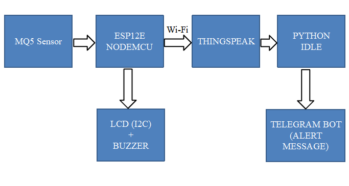
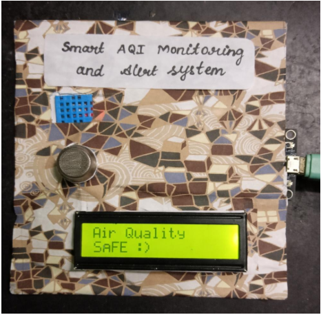
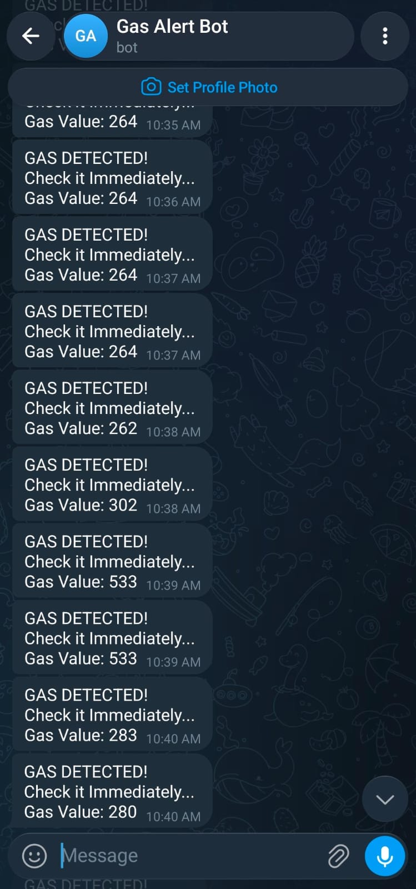

# Smart Indoor Air Quality Monitoring and Alert System Using ESP12E

## 1. Project Overview

The **Smart Indoor Air Quality Monitoring and Alert System Using ESP12E** is an Internet of Things (IoT)-based embedded monitoring system designed to monitor indoor temperature, relative humidity, and gas sensor readings. The system integrates an ESP8266-based ESP12E board, MQ-5 gas sensor, DHT11 sensor, I2C LCD, and buzzer to provide local monitoring and alert functionality.

Sensor measurements are transmitted to the ThingSpeak cloud platform through Wi-Fi for remote monitoring and graphical visualisation. In addition, a Python-based application retrieves the latest gas sensor reading from ThingSpeak and sends notifications through the Telegram Bot API when the configured alert threshold is exceeded.

## 2. Abstract

Indoor environmental monitoring provides a means of observing changes in temperature, humidity, and gas sensor readings. This project presents an IoT-based monitoring system that integrates embedded sensing, wireless communication, cloud data visualisation, and remote notifications.

The ESP12E acquires readings from the MQ-5 gas sensor and DHT11 temperature and humidity sensor. The measurements are displayed on an I2C LCD, while a buzzer provides a local indication when the gas sensor reading exceeds a predefined firmware threshold. The collected measurements are uploaded to ThingSpeak, where they can be monitored through graphical representations. A Python application periodically retrieves the latest gas reading and uses the Telegram Bot API to deliver remote alerts when the configured software threshold is exceeded.

The implementation demonstrates the integration of embedded hardware, sensor interfacing, Wi-Fi connectivity, cloud monitoring, and messaging services in a single prototype.

## 3. Objectives

* To monitor indoor temperature, relative humidity, and gas sensor readings.
* To display sensor measurements and system status using an I2C LCD.
* To provide a local audible indication when the configured gas threshold is exceeded.
* To transmit sensor measurements to ThingSpeak through Wi-Fi connectivity.
* To implement remote gas detection notifications using Python and the Telegram Bot API.
* To integrate embedded hardware and cloud-based monitoring into a unified prototype.

## 4. System Architecture

The proposed system consists of a sensing unit, an embedded processing and communication unit, a local display and alarm unit, a cloud monitoring platform, and a remote notification application.

The MQ-5 gas sensor provides gas-related sensor readings, while the DHT11 measures temperature and relative humidity. The ESP12E processes the sensor data, updates the LCD, controls the buzzer according to the configured threshold, and transmits measurements to ThingSpeak. The Python application independently retrieves the latest gas reading from the cloud and sends a Telegram notification when the software alert condition is satisfied.

### Block Diagram

## 5. Hardware Components

| Component        | Function                                                               |
| ---------------- | ---------------------------------------------------------------------- |
| ESP12E / ESP8266 | Embedded processing and Wi-Fi communication                            |
| MQ-5 Gas Sensor  | Provides gas sensor readings                                           |
| DHT11 Sensor     | Measures temperature and relative humidity                             |
| 16 × 2 I2C LCD   | Displays sensor measurements and system status                         |
| Buzzer           | Provides an audible indication when the firmware threshold is exceeded |
| Connecting Wires | Establish electrical connections between components                    |
| Power Supply     | Supplies operating power to the prototype                              |

## 6. Software and Technologies Used

* **Arduino IDE:** Embedded firmware development and programming.
* **ESP8266WiFi Library:** Wi-Fi network connectivity.
* **ThingSpeak Library:** Cloud data transmission.
* **DHT Library:** Temperature and humidity sensor interfacing.
* **LiquidCrystal_I2C Library:** LCD interfacing through the I2C protocol.
* **Python:** Cloud data retrieval and alert processing.
* **Requests Library:** HTTP communication with cloud and messaging services.
* **ThingSpeak:** Cloud-based sensor data storage and graphical visualisation.
* **Telegram Bot API:** Remote alert notification delivery.

## 7. Working Principle

### 7.1 Sensor Data Acquisition

The DHT11 measures temperature and relative humidity, while the MQ-5 sensor provides an analogue gas sensor reading. The ESP12E periodically reads these values and outputs the measurements to the serial monitor.

### 7.2 Local Display and Alert

The LCD displays temperature and humidity, followed by the gas sensor reading and a corresponding status message. The buzzer is activated when the gas sensor reading exceeds the firmware threshold of 150. Otherwise, the buzzer remains off.

### 7.3 Cloud Data Transmission

The ESP12E connects to a Wi-Fi network and uploads the measured temperature, humidity, and gas sensor reading to three ThingSpeak data fields. These measurements can subsequently be observed through the ThingSpeak channel's graphical interface.

### 7.4 Remote Notification

A Python application periodically retrieves the latest data feed from ThingSpeak and extracts the gas sensor reading. When the reading exceeds the configured software threshold of 800, the application generates a gas detection message containing the measured value and sends it through the Telegram Bot API.

The firmware threshold and software alert threshold are independently configured values. Consequently, local buzzer activation and remote Telegram notification may occur at different readings.

## 8. Hardware Implementation

The prototype integrates the ESP12E, MQ-5 gas sensor, DHT11 sensor, LCD, and buzzer into a single indoor monitoring unit. The LCD provides local access to the measured values and system status, while the wireless connection supports cloud-based monitoring.

### Project Prototype

## 9. Cloud Monitoring and Data Visualisation

ThingSpeak is used to store and visualise the sensor measurements transmitted by the ESP12E. Separate data fields represent temperature, humidity, and gas sensor readings, enabling the recorded measurements to be observed through graphical representations.

Cloud-based visualisation supports remote observation of sensor behaviour and provides a convenient way to review the collected data over time.

### ThingSpeak Graph Visualisation

## 10. Telegram Alert Mechanism

The Python application retrieves the latest gas sensor reading from ThingSpeak at regular intervals. When the reading exceeds the configured threshold, the application generates a Telegram message containing a gas detection warning and the measured sensor value.

This mechanism supplements the local buzzer with a remote notification facility. Under the current implementation, repeated notifications may be generated while the reading remains above the threshold because the application checks the latest reading during each polling cycle.

### Telegram Alert Screenshot

## 11. Results and Observations

The implemented prototype demonstrates the integration of the following functions:

* Acquisition of temperature, humidity, and gas sensor readings.
* Local display of measurements and status information through the I2C LCD.
* Buzzer control based on the configured firmware gas threshold.
* Transmission of sensor measurements to ThingSpeak.
* Graphical visualisation of cloud-based sensor data.
* Periodic retrieval of gas sensor readings through Python.
* Telegram notification generation when the configured software threshold is exceeded.

The prototype demonstrates the integration of embedded sensing, wireless communication, cloud monitoring, and remote messaging. The gas sensor readings and thresholds are intended for prototype-level monitoring and require appropriate calibration and validation before any safety-critical application.

## 12. Limitations and Future Enhancements

The current implementation uses predefined thresholds and does not provide certified air quality measurements. Gas sensor response can vary with environmental conditions, calibration, and the gases present. Remote monitoring and notifications also depend on network connectivity and the availability of the cloud and messaging services.

Future enhancements may include sensor calibration, additional environmental sensors, improved alert management, configurable thresholds, data logging, and an enhanced monitoring dashboard.

## 13. Project Team

### Subash M — Project Lead

**Email:** [subashmece48@gmail.com](mailto:subashmece48@gmail.com)

Responsible for project coordination, circuit connections, embedded software integration, and system modelling. Technical areas include ESP8266 programming, sensor interfacing, and IoT system integration.

### Daanish Fahad M — Team Member

**Email:** [daanishfahad1@gmail.com](mailto:daanishfahad1@gmail.com)

Technical interests include electronic circuit fundamentals, hardware components, and sensor-based monitoring systems. Relevant technical areas include embedded systems concepts and IoT application fundamentals.

### Uthaya Prakash S — Team Member

**Email:** [udhayaprakash2006@gmail.com](mailto:udhayaprakash2006@gmail.com)

Technical interests include electronic measurement systems, digital electronics, and hardware interfacing concepts. Relevant technical areas include environmental monitoring systems and cloud-based data visualisation.

### Yokesh P — Team Member

**Email:** [yokeshperumal2007@gmail.com](mailto:yokeshperumal2007@gmail.com)

Technical interests include microcontroller-based systems, electronic components, and wireless communication concepts. Relevant technical areas include embedded application fundamentals and IoT monitoring technologies.
